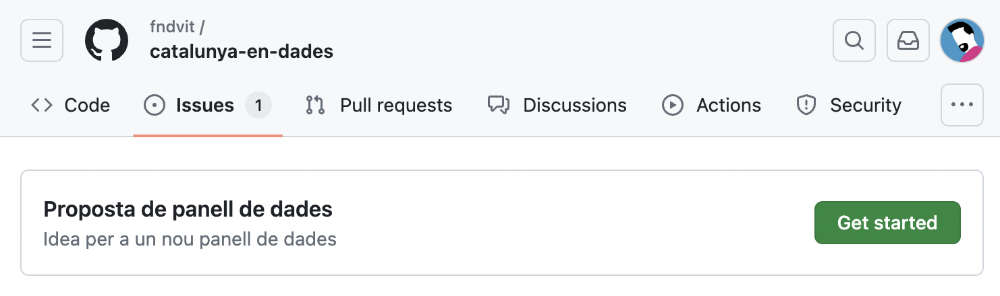

# Vols participar?
La iniciativa està dirigida a **persones que encara estan aprenent i desenvolupant les seves habilitats en ciència de dades, comunicació de dades, visualització, disseny d'interfícies i camps relacionats**. Això inclou estudiants actuals, persones que s'estan formant de manera autodidacta, i gent que hagi començat recentment a explorar aquest camp. D'aquesta manera, volem fomentar la participació d'aquells que estan en les primeres etapes del seu aprenentatge, independentment de l'edat o el camí educatiu seguit, per crear un entorn just i de suport per als nous talents.

Per participar [**obre un Issue en GitHub**](https://github.com/fndvit/catalunya-en-dades/issues) amb la teva proposta. Hem creat una plantilla ja per que omplis la informació minima que necessitem per valorarla teva proposta.

La competició no està oberta a professionals establerts o aquells que ja tenen una experiència significativa en ciència de dades. Si voleu col·laborar d'una altra manera, o la vostra empresa/organització vol patrocinar la iniciativa, [poseu-vos en contacte amb nosaltres](mailto:karma@fundaciovit.org).

## Premis
La iniciativa vol incentivar i reconèixer l'excel·lència i la creativitat en les visualitzacions de dades obertes. Per animar-vos a tots a participar i presentar les vostres idees i projectes, donarem **🏅premis mensuals de €500** a les millors aportacions, a partir de setembre de 2024.

L'equip de la ViT seleccionarà els guanyadors mensuals; mentre que el premi final serà atorgat per un guardonat equip internacional de jutges.

Els guanyadors mensuals es convertiran automàticament en finalistes. Els jutges també podran incloure altres presentacions que considerin destacables. Això significa que tindran l'oportunitat de competir pel **🏆 gran premi final de €2.500**.

## Mentories
L'equip de la Fundació ViT inclou especialistes en dades obertes, dataviz i disseny interactiu, visualització científica, ètica de la IA, aprenentatge automàtic, etc. i està liderat pels multipremiats experts [Karma Peiró](https://ca.wikipedia.org/wiki/Karma_Peir%C3%B3), [Xaquín G.V.](https://explorers.nationalgeographic.org/directory/xaquin-veira-gonzalez) i Anton Bardera.

Les mentories són un dels fils principals de l'ADN de la ViT, els projectes d'estudiants del nostre *Master's in Visual Tools to Empower Citizens* han brillat en [concursos internacionals com els de la Society for News Design](https://x.com/josephricafort/status/1792089452166492592).

Com a part de la iniciativa, la Fundació ViT us ofereix **tres sessions de mentoria de mitja hora** amb el nostre equip per ajudar-vos a dissenyar i desenvolupar el projecte que tingueu entre mans.

### Reunió d'esborrany
L'objectiu d'aquesta primera reunió es revisar el vostre **esborrany** de la proposta. Per fer-ho, heu d'haver descarregat i estudiat les dades, i heu d'haver dibuixat la vostra proposta inicial d'estructura i gràfics possibles —llapis i prou. *A veure, si teniu un quadern d'Observable on estigueu dibuixant ja amb codi 👏👏👏*

### Revisió de l'interactiu
En aquesta reunió parlarem de dubtes, consideracions i problemes específics que tingueu amb la implementació tècnica o el disseny del panell o l'informe. Abans de la reunió, el codi ha d'estar a una branca específica del projecte (llegiu l'apartat de preguntes tècniques).

### Revisió final
En aquesta última reunió revisarem tota la feina feta, enfocant-nos en els últims detalls i ajustos necessaris per completar el projecte. Cal que abans de la reunió hàgiu integrat tot el codi a la branca, assegurant-vos que funcioni correctament.

Una vegada s'hagin fet els ajustos finals necessaris, es farà la *pull request* per incloure l'informe o el panell de dades al projecte.
