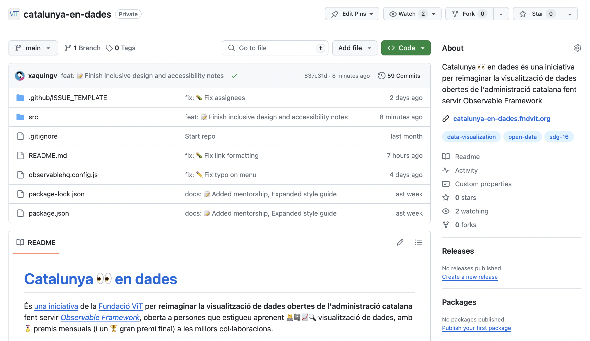

<style>
  img {
    border-radius: 1rem;
    box-shadow: 0 0 1rem rgba(0,0,0,0.15);
    max-width: 42rem;
    width: 100%;
    transition: all 0.3s;
  }
  img:hover {
    opacity:.7;
  }
</style>

```js
import chroma from "npm:chroma-js";
 
const dadesAtur = [
  { year: 2000, Barcelona: 10, Girona: 8, Lleida: 7, Tarragona: 9 },
  { year: 2001, Barcelona: 9, Girona: 7.5, Lleida: 6.8, Tarragona: 8.5 },
  { year: 2002, Barcelona: 8.5, Girona: 7.2, Lleida: 6.6, Tarragona: 8.2 },
  { year: 2003, Barcelona: 8.2, Girona: 7, Lleida: 6.3, Tarragona: 8 },
  { year: 2004, Barcelona: 8, Girona: 6.8, Lleida: 6, Tarragona: 7.8 },
  { year: 2005, Barcelona: 7.8, Girona: 6.6, Lleida: 5.8, Tarragona: 7.6 },
  { year: 2006, Barcelona: 7.5, Girona: 6.3, Lleida: 5.6, Tarragona: 7.3 },
  { year: 2007, Barcelona: 7.2, Girona: 6, Lleida: 5.4, Tarragona: 7 },
  { year: 2008, Barcelona: 7, Girona: 5.8, Lleida: 5.2, Tarragona: 6.8 },
  { year: 2009, Barcelona: 9, Girona: 7.5, Lleida: 6.8, Tarragona: 8.5 },
  { year: 2010, Barcelona: 9.5, Girona: 7.8, Lleida: 7, Tarragona: 8.8 },
  { year: 2011, Barcelona: 10, Girona: 8, Lleida: 7.2, Tarragona: 9 },
  { year: 2012, Barcelona: 10.5, Girona: 8.5, Lleida: 7.5, Tarragona: 9.5 },
  { year: 2013, Barcelona: 11, Girona: 9, Lleida: 8, Tarragona: 10 },
  { year: 2014, Barcelona: 10.8, Girona: 8.8, Lleida: 7.8, Tarragona: 9.8 },
  { year: 2015, Barcelona: 10.5, Girona: 8.5, Lleida: 7.5, Tarragona: 9.5 },
  { year: 2016, Barcelona: 10.2, Girona: 8.2, Lleida: 7.2, Tarragona: 9.2 },
  { year: 2017, Barcelona: 10, Girona: 8, Lleida: 7, Tarragona: 9 },
  { year: 2018, Barcelona: 9.8, Girona: 7.8, Lleida: 6.8, Tarragona: 8.8 },
  { year: 2019, Barcelona: 9.5, Girona: 7.5, Lleida: 6.5, Tarragona: 8.5 },
  { year: 2020, Barcelona: 10, Girona: 8, Lleida: 7, Tarragona: 9 },
  { year: 2021, Barcelona: 9.5, Girona: 7.5, Lleida: 6.5, Tarragona: 8.5 },
  { year: 2022, Barcelona: 9, Girona: 7, Lleida: 6, Tarragona: 8 },
  { year: 2023, Barcelona: 8, Girona: 6, Lleida: 5, Tarragona: 7 }
];

const blue = "#3b5fc0", yellow = "#ffd754", grey = "#c7c1bf", purple = "#a160af", orange = "#ff9c38", green = "#5ca34b", pink = "#f794b9", sky = "#61b0ff", red = "#ed393f", brown = "#a87a54";

const lineChartProvince = (width, height, province, color) => Plot.plot({
  width,
  height,
  marginRight: 60,
  marks: [
    Plot.lineY(dadesAtur, {x: "year", y:province, stroke: chroma(color).darken().hex(), strokeWidth: 3, title: province}),
    Plot.lineY(dadesAtur, {x: "year", y:province, stroke: chroma(color).darken().hex(), strokeWidth: 2, title: province, marker: "dot"}),
    Plot.lineY(dadesAtur, {x: "year", y:province, stroke: color, title: province, marker: "dot", curve: "monotone-x"}),
    Plot.text(dadesAtur, Plot.selectLast({x: "year", y: province, text: d => province, textAnchor: "start", dx: 6})),
  ],
  x: {
    label: "Any",
    tickFormat: d3.format("d")
  },
  y: {
    grid: true,
    domain: [5,11],
    label: "Taxa d'atur (%)"
  }
});

const MAPBOX_TOKEN = "pk.eyJ1IjoiZm5kdml0IiwiYSI6ImNseDR5dDV5dTBmeWMyaXNjemRkbDA3cHEifQ.HgSEJBTQzDFB-qBS2C4dvg";
```

# Qüestions tècniques
## Per on començar
El [projecte el tenim a *GitHub*](https://github.com/fndvit/catalunya-en-dades), per col·laborar eficaçment —i mantenir totes les discussions de les propostes en obert. 

<a href="https://github.com/fndvit/catalunya-en-dades" target="_blank"></a>

Clona el projecte. Entra a la carpeta, instal·la'l amb `npm i` i executa `npm run dev`. Veuràs aixó ...

<pre class="observablehq-pre-container" data-copy="none"><b class="green">Observable Framework</b> v1.8.0
↳ <u><a href="http://127.0.0.1:3000/" style="color: inherit;">http://127.0.0.1:3000/</a></u></pre>

### Un nou panell, una nova branca a GitHub, una nova pàgina
Per enviar la vostra proposta, vosaltres (o nosaltres) haureu creat un *Issue* a *GitHub* —com [s'explica a la pàgina de **participació**](./participa). Aquest *Issue* tindrà assignada una **branca primària**.

Per exemple, si heu proposat un panell de dades sobre ['Consum d'energia elèctrica per municipis i sectors de Catalunya'](https://analisi.transparenciacatalunya.cat/Energia/Consum-d-energia-el-ctrica-per-municipis-i-sectors/8idm-becu/about_data):

- N'hi haurà una branca anomenada `consum-electric`,
- per a cada *feature*, afegireu el que fareu amb el codi, per example una gràfica de barres `consum-electric/barchart`;
- i si formes part d'un equip, podeu optar per afegir-ne inicials per cadescú `consum-electric/barchart-xgv`.

Sigueu breus, concises i utilitzeu sempre `kebab-case`.

### Estructura del teu projecte

```
.
├─ src
│  ├─ projectes
│  │  └─ nom-projecte
│  │     ├─ data
│  │     │  └─ data-a.json
│  │     │  └─ data-b.json
│  │     │  └─ mapa.json
│  │     │  └─ ...
│  │     └─ index.md
│  └─ docs
│  └─ ...
└─ ...
```

### Un resum del procés:

- **Clona el repositori**
- **Canvia a la branca primària del teu projecte** 
- **Crea una nova pàgina**: Continuant amb l'exemple de dalt seria `projectes/consum-electric/index.md`
- **Crea una branca per a la teva feature**: Abans de fer cap canvi extra, crea una nova branca per a la teva *feature* seguint [l'estructura que vam explicar a dalt](#com-col·laborar-i-enviar-pull-requests-(prs)).
- **Fes els teus canvis i fes *commit*:** Fes els canvis necessaris al codi i fes un commit amb un missatge descriptiu.
- **Puja els canvis a GitHub**
- **Crea una *pull request* cap la teva branca de projecte:** Ves al repositori a GitHub i crea una PR des de la teva branca —on has implementat la teva *feature*— cap a la branca primària del teu panell de dades. 
- **I després una altra cap a `dev`:** Després de la última reunió de [mentoria](participa#mentories), crea una PR desde la branca primària del teu panell de dades cap a la branca `dev`. Afegeix una descripció clara dels canvis realitzats i qualsevol informació rellevant per a la revisió.
- **Revisió i *merge*:** Sol·licita als revisors que es mirin el teu PR. Fes els canvis sol·licitats si és necessari. Un cop el PR sigui aprovat, podrà ser fusionat a la branca `dev` del repositori original. (Només els mantenidors poden fer PR de `dev` a `main`)

Us recomanem fer servir [*GitHub Desktop*](https://desktop.github.com/) per gestionar l'accés al repositori o directament des de [*Visual Studio Code*](https://code.visualstudio.com/docs/sourcecontrol/github).

## Gràfics amb Plot
[*Plot*](https://observablehq.com/plot/what-is-plot) és una biblioteca de *JavaScript* desenvolupada per *Observable* per a la visualització de dades, especialment dissenyada per accelerar l'anàlisi exploratòria de dades. Ofereix una interfície concisa i expressiva que permet crear gràfics sofisticats amb menys codi. *Plot* està construït sobre [d3](https://d3js.org/), però simplifica moltes de les seves operacions per facilitar-ne l'ús.

### Exemple de codi per a gràfic de línies
Aquest exemple visualitza dades anuals d'atur per província a Catalunya.

```js echo
dadesAtur
```

${resize((width) => lineChart(width))}


```js echo
const lineChart = (width) => Plot.plot({
  width,
  height: width * 0.5,
  marginRight: 60,
  marks: [
    Plot.lineY(dadesAtur, {x: "year", y: "Barcelona", stroke: blue, title: "Barcelona", marker: true, curve: "monotone-x", tip: true}),
    Plot.lineY(dadesAtur, {x: "year", y: "Girona", stroke: yellow, title: "Girona", marker: true, curve: "monotone-x", tip: true}),
    Plot.lineY(dadesAtur, {x: "year", y: "Lleida", stroke: grey, title: "Lleida", marker: true, curve: "monotone-x", tip: true}),
    Plot.lineY(dadesAtur, {x: "year", y: "Tarragona", stroke: purple, title: "Tarragona", marker: true, curve: "monotone-x", tip: true}),
    Plot.text(dadesAtur, Plot.selectLast({x: "year", y: "Barcelona", text: d => "Barcelona", textAnchor: "start", dx: 6})),
    Plot.text(dadesAtur, Plot.selectLast({x: "year", y: "Girona", text: d =>  "Girona", textAnchor: "start", dx: 6})),
    Plot.text(dadesAtur, Plot.selectLast({x: "year", y: "Lleida", text: d =>  "Lleida", textAnchor: "start", dx: 6})),
    Plot.text(dadesAtur, Plot.selectLast({x: "year", y: "Tarragona", text: d =>  "Tarragona", textAnchor: "start", dx: 6}))
  ],
  x: {
    label: "Any",
    tickFormat: d3.format("d")
  },
  y: {
    grid: true,
    label: "Taxa d'atur (%)"
  }
});
```

Normalment, utilitzareu els **gràfics dins de targetes** en un panell de dades. Llegiu més sobre les [nostres guies sobre com estructurar panells per a aquest projecte](./guia.md) i sobre com funcionen les [*grids* a *Observable Framework*](https://observablehq.com/framework/markdown#grids).

A sota es mostra un exemple de quatre *cards* per a les quatre províncies.

```html echo
<div class="grid grid-cols-4" style="grid-auto-rows: 240px;">
  <div class="card">
    ${resize((width, height) => lineChartProvince(width, height, "Barcelona", blue))}
  </div>
  <div class="card">
    ${resize((width, height) => lineChartProvince(width, height, "Tarragona", purple))}
  </div>
  <div class="card">
    ${resize((width, height) => lineChartProvince(width, height, "Girona", yellow))}
  </div>
  <div class="card">
    ${resize((width, height) => lineChartProvince(width, height, "Lleida", grey))}
  </div>
</div>
```

Més examples de gràfics aqui.

## Mapes amb Mapbox
[*Mapbox*](https://www.mapbox.com/) és una llibreria per produïr mapes interactius en aplicacions web. En aquesta secció, explorarem com utilitzar *Mapbox* a *Observable Framework* per crear, per example, mapes coroplètics per mostrar dades geoespacials.

### Exemple de codi per a un mapa bàsic
Aquest exemple mostra com integrar un **mapa bàsic de Mapbox** dins d'*Observable*.

```js echo
const simple = display(document.createElement("div"));
simple.style = "height: 480px;";

const map = new mapboxgl.Map({
  container: simple,
  accessToken: MAPBOX_TOKEN,
  style: 'mapbox://styles/fndvit/clx4zgywv00af01qq1jp42apa',
  center: [2.1745, 41.404],
  zoom: 16,
  pitch: 62,
  bearing: -20
});

invalidation.then(() => map.remove());
```

### Exemple de codi per a un mapa de coropletes
Aquest exemple mostra com crear un mapa coroplètic, que fa servir **color per representar la variable estadística al mapa**. En aquest cas es visualitzen dades d'atur per província.

```js echo
const choropleth = display(document.createElement("div"));
choropleth.style = "height: 540px;";

const map = new mapboxgl.Map({
  container: choropleth,
  accessToken: MAPBOX_TOKEN,
  style: 'mapbox://styles/fndvit/clvnpq95k01jg01qz1px52jzf',
  center: [2.1745, 41.65],
  zoom: 6.8
});

const unemploymentData = [
  { province: "Barcelona", rate: 8 },
  { province: "Girona", rate: 6 },
  { province: "Lleida", rate: 5 },
  { province: "Tarragona", rate: 7 }
];

const createColorExpression = (data) => {
  const colorExpression = [
    "step",
    ["get", "rate"],
    "#f0f0f0",
    5,
    "#fec3b8",
    6,
    "#c289a8",
    7,
    "#885198",
    8,
    "#4c1787"
  ];

  const matchExpression = ["match", ["get", "name"]];

  data.forEach((entry) => {
    matchExpression.push(entry.province, entry.rate);
  });

  matchExpression.push(0);

  colorExpression[1] = matchExpression;

  return colorExpression;
};

map.on('load', function () {
  map.addSource('unemployment', {
    type: 'geojson',
    data: 'https://raw.githubusercontent.com/codeforamerica/click_that_hood/master/public/data/spain-provinces.geojson'
  });

  map.addLayer({
    id: 'unemployment-layer',
    type: 'fill',
    source: 'unemployment',
    paint: {
      'fill-color': createColorExpression(unemploymentData),
      'fill-opacity': 0.5,
      "fill-outline-color": createColorExpression(unemploymentData)
    }
  }, "waterway");
});

```

## Carregadors de dades
Els carregadors de dades (*data loaders*) permeten generar instantànies de dades pre-processades durant el procés de construcció del projecte. Poden ser escrits en qualsevol llenguatge de programació i són útils per accedir, transformar i preparar dades per a la seva visualització.

### Avantatges dels carregadors de dades
* **Poliglotisme:** Pots utilitzar qualsevol llenguatge de programació que prefereixis, com *Python*, *R*, *SQL*, *JavaScript*, entre altres. Això facilita que equips diversos treballin amb les eines amb les quals estan més còmodes.
* **Rendiment:** Els carregadors de dades poden processar grans quantitats de dades en temps de construcció, la qual cosa redueix el temps de càrrega del client. Això resulta en pàgines més ràpides.
* **Optimització:** Permeten filtrar, agregar i minimitzar les dades enviades al client, millorant la seguretat i privacitat de les dades mostrades.

### Exemple de codi per a un carregador de dades en *JavaScript*
Suposem que volem carregar dades dels embassaments a Catalunya des de [l'API del Portal de Transparència de Catalunya](https://analisi.transparenciacatalunya.cat/Medi-Ambient/Quantitat-d-aigua-als-embassaments-de-les-Conques-/gn9e-3qhr/about_data).

```js run=false
const response = await fetch("https://analisi.transparenciacatalunya.cat/resource/gn9e-3qhr.json?$limit=32877");
if (!response.ok) throw new Error(`fetch failed: ${response.status}`);
const json = await response.json();

const data = json.map((d) => {
  const capacity = (100 * d.volum_embassat) / d.percentatge_volum_embassat;
  const date = new Date(d.dia);
  const pct = +d.percentatge_volum_embassat;
  const level = +d.volum_embassat;
  return { date, pct, level, capacity };
}).sort( (a,b) => a.date - b.date);

process.stdout.write(JSON.stringify(data));
```

```js
const response = await fetch("https://analisi.transparenciacatalunya.cat/resource/gn9e-3qhr.json?$limit=32877");
if (!response.ok) throw new Error(`fetch failed: ${response.status}`);
const json = await response.json();

const embassaments = json.map((d) => {
  const capacity = (100 * d.volum_embassat) / d.percentatge_volum_embassat;
  const date = new Date(d.dia);
  const pct = +d.percentatge_volum_embassat;
  const level = +d.volum_embassat;
  return { date, pct, level, capacity };
}).sort( (a,b) => a.date - b.date);
```

Aquest carregador de dades obté dades des d'una API, les transforma al format adequat i genera un fitxer *JSON* amb les dades dels embassaments.

### Com utilitzar els carregadors de dades
Si el carregador aquest es diu per exemple `embassaments.json.js`, haurà generat un fitxer `embassaments.json`: ara pots accedir-hi des del client utilitzant `FileAttachment`.

```js run=false
const embassaments = FileAttachment("data/dades.json").json();
```

`FileAttachment` retorna una `Promise`, podeu utilitzar les dades en un bloc de codi diferent només cridant `embassaments`.

```js echo
embassaments
```

Per a més informació i exemples sobre com escriure carregadors de dades en diferents llenguatges, pots visitar [la documentació d'*Observable Framework*](https://observablehq.com/framework/loaders).

## Bones pràctiques
Per mantenir el projectes ordenat i comprensible —donat que es un projecte col·laboratiu— cal que tingueu en compte aquestes bones pràctiques per mantenir el codi ben organitzat i ben comentat.

- **Nomenclatura consistent:** Utilitza noms descriptius i coherents per a variables, funcions i arxius. Això fa que el codi sigui més llegible i fàcil de mantenir.
- **Comentaris eficients:** Afegeix comentaris només quan sigui necessari per explicar el perquè d'alguna cosa, no el què. Els bons comentaris expliquen les decisions i intencions del codi.
- **Estructura Clara:** Organitza el codi en blocs lògics i utilitza l'indentació adequada. Divideix el codi en mòduls o fitxers segons la seva funcionalitat.
- **Refactorització Regular:** Refactoritza el codi regularment per millorar la seva claredat i eficiència sense canviar el seu comportament extern.