
# Sobre el nostre equip
TK TK algo guai de nosaltres i l'equip, els premis? 

  

    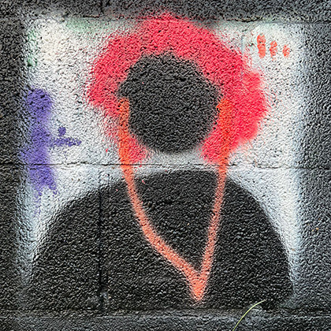
    <h2>Karma Peiró</h2>
    
És periodista, experta en ètica en IA i activista de dades amb experiència a La Vanguardia, TV3 i Catalunya Ràdio, i com a directora  de NacióDigital. Si la trobeu a prop d'una màquina de pinball, us desafiarà i probablement us aixafarà.

  

  

    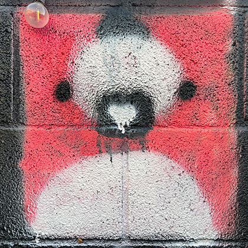
    <h2>Xaquín G.V.</h2>
    
És periodista visual, expert en dades i el pare d'en Roi. Ha treballat a The New York Times i The Guardian, on va dirigir el seu guardonat equip Visual, entre altres llocs. Dobleteja com xef: "De gràfics, potser no sé gaire, però de menjar... de menjar soc un <em>pro</em>".

  

  

    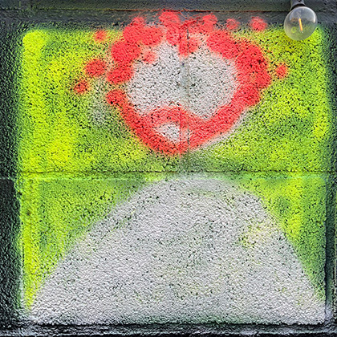
    <h2>Anton Bardera</h2>
    
És professor associat de la Universitat de Girona, realitza recerca en imatge mèdica, processament d'imatges, visualització i teoria de la informació. Si no respon als vostres correus, probablement està fent excursions per la muntanya o ha perdut el telèfon.

  

  

    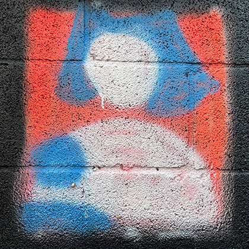
    <h2>Apple C. Fardel</h2>
    
És una enginyera amb experiència en interfícies d'usuari inclusives, visualització de dades i aprenentatge automàtic. Això era una vegada ... va treballar com a desenvolupadora interactiva a The Guardian. Li encanta esquiar, escalar i bussejar amb els seus K/k/kids.

  

  

    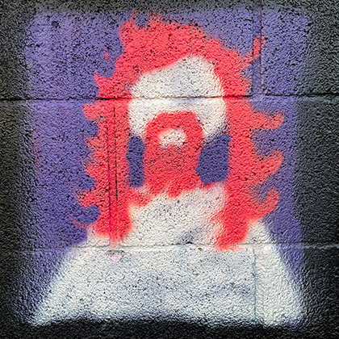
    <h2>Matt Osborn</h2>
    
És un enginyer amb formació en diverses disciplines, amb experiència en processament de dades, anàlisi, visualització i disseny web interactiu. Ha treballat en projectes de dataviz basats en la web i va passar una estoneta a The Guardian.

  

  

    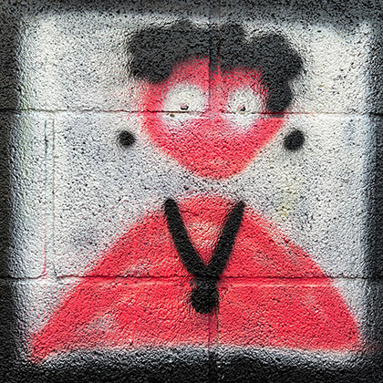
    <h2>Aleix Alvarez</h2>
    
És enginyer informàtic i llicenciat per la Universitat de Girona. Competència en diverses àrees de la informàtica, com ara desenvolupament de programari, administració de xarxes i gestió de bases de dades. なぜコンピュータが日本に行ったのですか？寿司のバイトをもらうでらうたすすか

  

  

    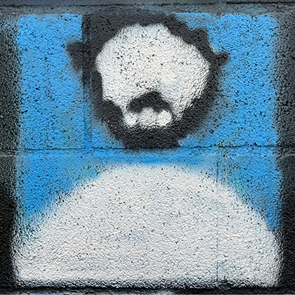
    <h2>Miguel Villalobos</h2>
    
És un desenvolupador de jocs especialitzat en disseny d'interfícies d'usuari, amb experiència en desenvolupament de videojocs i disseny web interactiu. Com amb qualsevol cinèfil, potser el trobareu veient una pel·lícula que ningú coneix durant el seu temps lliure.

  

  

    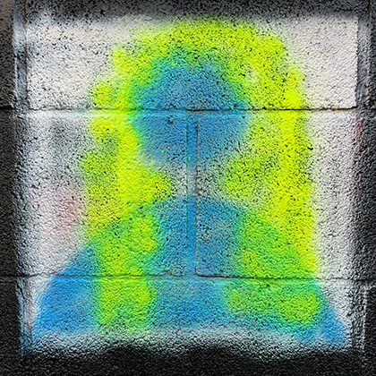
    <h2>Laia Verdaguer</h2>
    
És desenvolupadora de jocs llicenciada per la Universitat de Girona. Durant el dia és dissenyadora i desenvolupadora especialitzada en interfícies i visualització basades en dades. Però quan cau la nit es torna ... il·lustradora!

  

  

    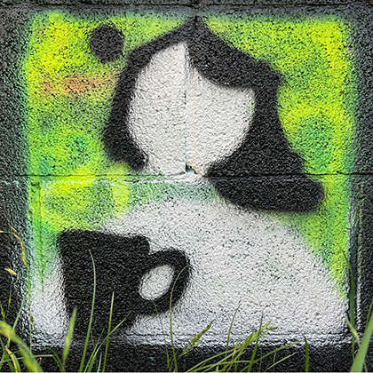
    <h2>Denisse Carvajal</h2>
    
És project manager amb un recorregut des del disseny, l'enginyeria i el màster en Data Science. Exploradora, ciclista aficionada, aficionada al vi i monocular de naixement, per la qual cosa aprens constantment tot allò que amplia el seu enfocament.

  

  

    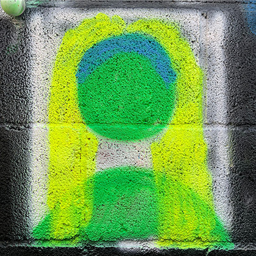
    <h2>Judit Quintana</h2>
    
És enginyera informàtica amb un màster en Ciència de Dades i una passió per la visualització de dades. Segur que està provant tots els esports o submergint-se en noves aficions artesanals. No és una professional en res... i això es la millor part!

  

  

    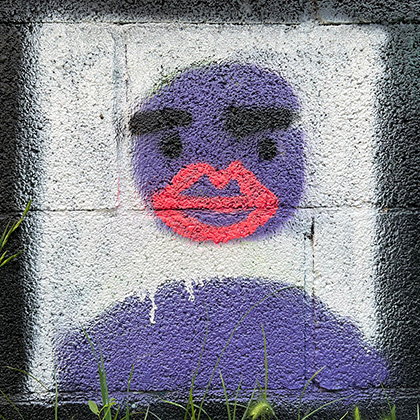
    <h2>Pol Darder</h2>
  

