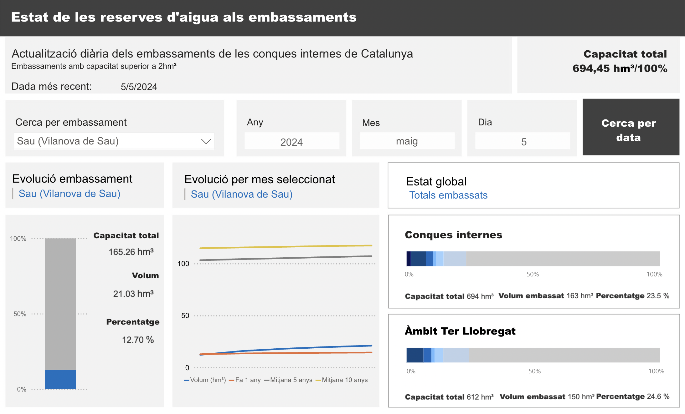
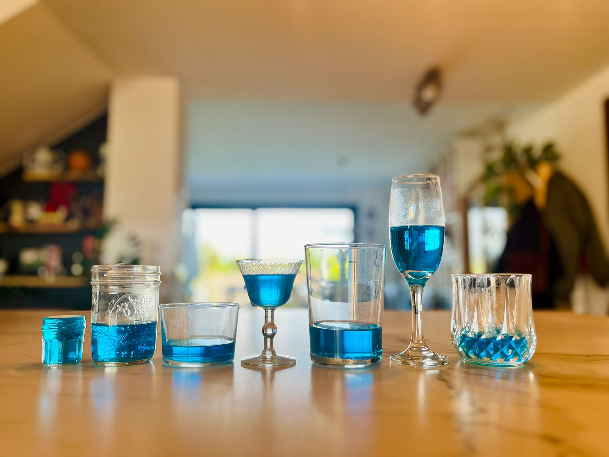

# Per example ...
## Visualitzem els embassaments a les conques internes de Catalunya
L’Agència Catalana de l'Aigua (ACA) ha fet una feina excepcional visualitzant dades crítiques sobre els recursos hídrics. Han implementat una visualització captivadora que mapeja els impactes de la sequera al territori, però considerem que el seu panell de dades sobre els nivells dels embassaments és una oportunitat perduda. 

En aquesta primera iteració (**https://sequera.fndvit.org/**), hem anat cap a les dades que estaven més a mà, però volem explorar com fer també el mapa —potser el veureu inclòs en properes entregues. (El nostre objectiu final és posar a prova els límits i les  virtuts del Observable per a experiències de dades simples i complexes.)

Quan pensàvem en el redisseny, **vam fer-nos les mateixes preguntes** sobre les dades que en el taulell original, però l**es vam respondre amb gràfics lleugerament diferents**:
- Quina és la situació actual (l’estat dels embassaments com a percentatge de la capacitat total)
- Quins embassaments estan més plens o més buits
- I quines són les tendències individuals — hem afegit la tendència general per completar i contextualitzar la situació actual.

En modificar l'aproximació de l'ACA a la visualització de les dades dels embassaments, volem proporcionar una visió més clara i completa de l'estat dels recursos hídrics a Catalunya.

<iframe id="iframe" scrolling="no" src="https://sequera.fndvit.org/"></iframe>

Hem afegit un gràfic de barres apilades d’amplada variable (bé... l’alçada en aquest cas), també conegut com a **gràfic de Marimekko**, per representar els nivells dels embassaments. Això permet representar capacitat i nivells al mateix temps, per veure quins són els embassaments principals i com estan de plens o buits. Mostrar les dues variables alhora dona una altra perspectiva respecte als gràfics de barres tradicionals. A més, som molt *fans* d’aquest tipus de visualització —igual que dels beeswarms. Però és que ... digueu-nos, **com visualitzaríeu la realitat que mostrem a sota 👇👇👇** d'una altra manera?

En aquest exemple però, ja podem anticipar **algunes millores futures**:
- Incorporar dades de la Confederació Hidrogràfica de l'Ebre (un dels projectes treballat al Màster en “Eines Visuals per Empoderar la Ciutadania” ja tenia aquesta funcionalitat).
- Un mapa d'impacte de la sequera a Catalunya (les dades del portal de Transparència s'actualitzen poc sovint, i les que són en temps real necessiten càlculs geoespacials).
- Un informe com el PDF que proporciona diàriament l'Agència Catalana de l’Aigua.
