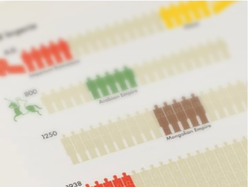
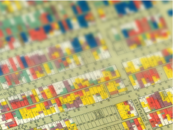

# Patrocinadors
Necessitem el teu suport per fer-lo realitat. T'invitem a unir-te a nosaltres com a **sponsor** i formar part d'aquesta emocionant iniciativa. 

## Tria entre les següents categories

  

    
    <h2>Marie Neurath</h2>
    <h3>Contribució: €2.500</h3>
    <h3>Patrocinis disponibles: 2</h3>
    
En honor a la pionera <a href="https://www.marieneurath.org/" target="_blank">Marie Neurath</a>, que va revolucionar la visualització de dades, aquesta categoria de donació està destinada a aquells que vulguin fer una contribució significativa. La teva generositat impulsarà els nostres esforços per oferir formació davantera i recursos formatius d’alta qualitat.

  

  

    
    <h2>Mary Eleanor Spear</h2>
    <h3>Contribució: €1.000</h3>
    <h3>Patrocinis disponibles: 5</h3>
    
Inspirada en <a href="https://ca.wikipedia.org/wiki/Mary_Eleanor_Spear" target="_blank">Mary Eleanor Spear</a>, una destacada estadística i defensora de la igualtat d’oportunitats, si dones en aquesta categoria estaràs promovent l'accessibilitat i la inclusió en el camp de les dades. La teva contribució ens ajudarà a fomentar la diversitat en l’anàlisi de dades.

  

  

    
    <h2>Categoria Agnes Sinclair Holbrook</h2>
    <h3>Contribució: €500</h3>
    <h3>Patrocinis disponibles: 10</h3>
    
<a href="https://othercartographies.com/Chicago-s-demographic" target="_blank">Agnes Sinclair Holbrook</a> va ser pionera en l’ús de mapes i visualitzacions de dades per promoure reformes socials. Aquesta categoria de donació està destinada a aquells que comparteixen la nostra passió per utilitzar les dades com a eina de canvi positiu.

  

Gràcies pel teu suport!
